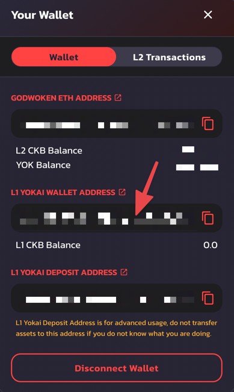
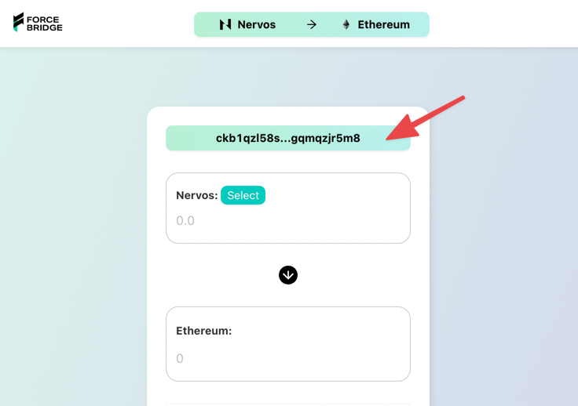
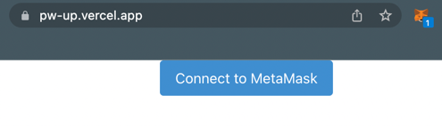
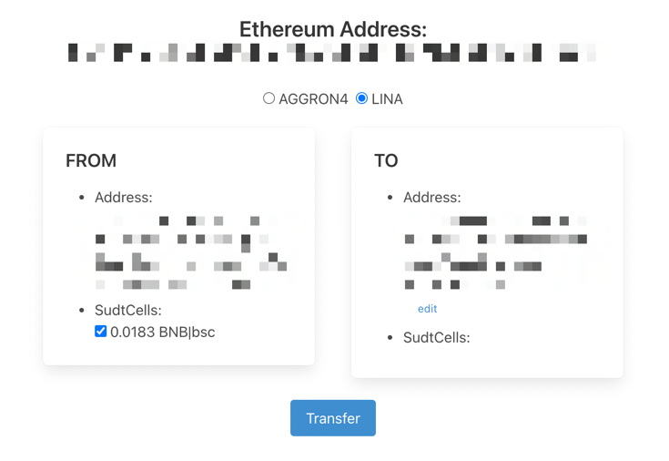
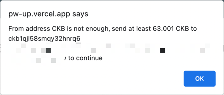
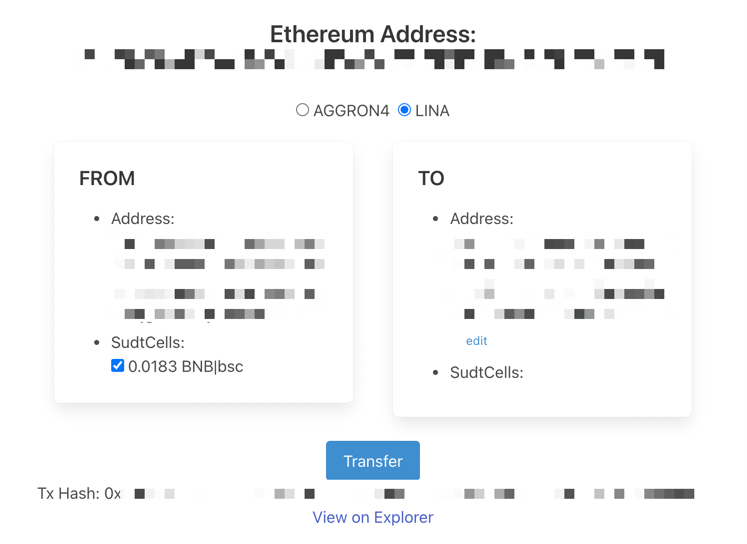
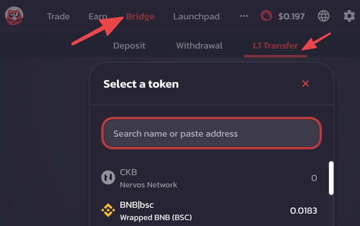

# Asset Migration Guide

There are two existing wallets on Nervos Network Mainnet to enable users to use Ethereum wallets as Nervos wallets: [omni-lock](https://github.com/XuJiandong/docs-bank/blob/master/omni_lock.md) and [pw-lock](https://github.com/lay2dev/pw-lock).

For historical reason, Yokaiswap uses omni-lock and Force Bridge uses pw-lock.

When the Yokai wallet and Force Bridge are connected with the same Ethereum account, we can find the associated Nervos address in following places.  

https://www.yokaiswap.com/

https://forcebridge.com/bridge/Nervos/Ethereum

There is no UI for pw-lock to manipulate SUDT on Nervos Network. When users have mirror assets(e.g. `ETH|eth`, `BNB|bsc`) in pw-lock, it's inconvenient to move the assets to Yokaiswap again. They have to bridge the assets to Ethereum and back again, which will cause a big transaction fee loss. Even worse situation is that when their asset is not enough to pay for the cross chain fee, the asset might be stuck in the Force Bridge address.

To solve the problems, Force Bridge is planning to switch the wallet from pw-lock to omni-lock. When it's finished, Yokai L1 wallet and Force Bridge wallet will be the same.

We also provide a tool to help users migrate their assets in pw-lock to omni-lock. 

- The migration tool UI: <https://pw-up.vercel.app/>
- Source Code: <https://github.com/homura/pw-up>

> WARNING: This tool is provided by the community, **USE IT AT YOUR OWN RISK**. It's recommended to test with some small asset first.

## Migration Guide

visit <https://pw-up.vercel.app/>

Connect to Metamask. Select the LINA network, check your assets in the wallet you can migrate. Click `Transfer` if you confirm to migrate.

If you got this error, fund the from address with enough CKB.
You can transfer from your CKB wallet or exchange wallet to the from address. 

> **Note:** Some wallet or exchange may not support the CKB address, it's recommended to use imToken or Binance.

If everything goes well, you will see the transaction hash below the `Transfer` button. You can click to check it on the Nervos Explorer.

When the transaction is confirmed, you can see your asset on Yokaiswap too.

This tool only migrate all your SUDT assets. If you want to transfer your remain CKB in your pw-lock, you can use [pw-wallet UI](https://ckb.pw/#/).
