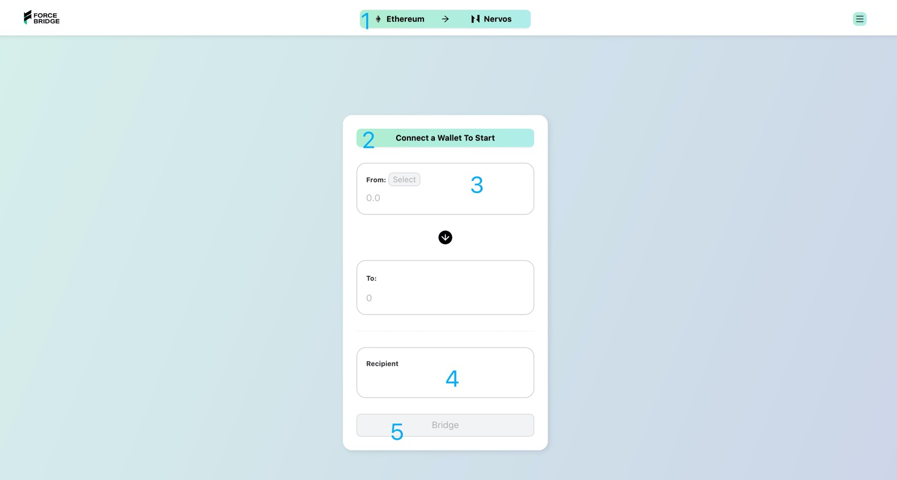
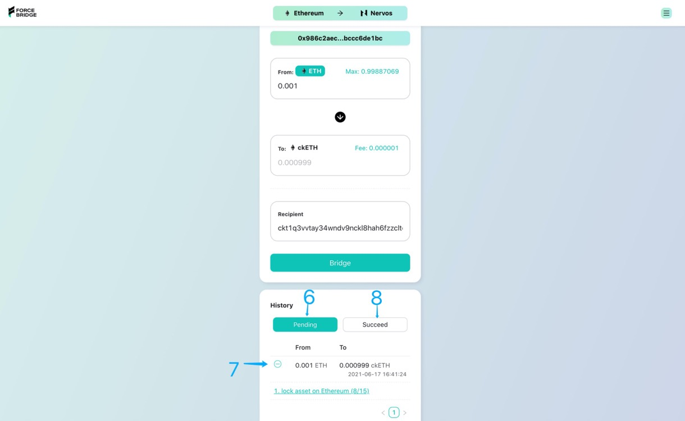

# Force Bridge Dapp User Guide

Force bridge is a cross-chain bridge connecting CKB and other blockchains. Force bridge supports Ethereum currently, and will support more blockchains, such as Bitcoin, Tron, Eos, etc. Users can use force bridge to lock assets on these blockchains and gain shadow assets on CKB, or to burn shadow assets on CKB and receive original assets.

This article uses Ethereum as an example to introduce the bridge operation between Ethereum testnet rinkeby and CKB testnet aggron.

## Prepare Wallet

If you have a metamask account, you are ready to go. You will use this account to manage assets on Ethereum and CKB (with the help of [pw-lock](https://github.com/lay2dev/pw-lock)).

> You can set up metamask here: https://metamask.io/

## Prepare initial assets

Use this [faucet](https://gliaswap-faucet-rinkeby.ckbapp.dev/) to claim CKB、ETH and ERC-20 assets. 

> We also need CKB and ETH to pay transaction fee on CKB-Blockchain and Ethereum.

## Start Bridge

### Etherum to CKB

1. Choose bridge direction: Ethereum to CKB
2. Connect metamask wallet
3. Select the asset you want to bridge and input bridge amount
4. The recipient address is the ckb address([pw-lock](https://github.com/lay2dev/pw-lock)) of your metamask account by default, and will be autofilled for you. If you want another address to receive shadow asset, feel free to replace it.
5. Tap button to bridge

6. Check the bridging status
7. View the details of bridge transactions
8. Succeed bridge history will be here

### CKB to Ethereum

Change the bridge direction, and the following operations are similar.

## Open dapp with parameterized url

- Parameterized url example: https://force-bridge-dev.ckbapp.dev/bridge/:from-network/:to-network?xchain-asset=0x0000000000000000000000000000000000000000&amount=0.05&recipient=ckt1q3vvtay34wndv9nckl8hah6fzzcltcqwcrx79apwp2a5lkd07fdx8xrv9tkdrcff8nwev8q9zzvf40xvdhsmck9seps
  - Explain
    - Url path
      - from-network: string (e.g. Ethereum)
      - to-network: string (e.g. Nervos)
    - Url query
      - xchain-asset: the address of original asset (e.g.,  xchain-asset=0x0000000000000000000000000000000000000000 means ETH asset)
      - amount: the bridge amount (e.g., amount=0.05 means 0.05 ETH)
      - recipient: the address of recipient
