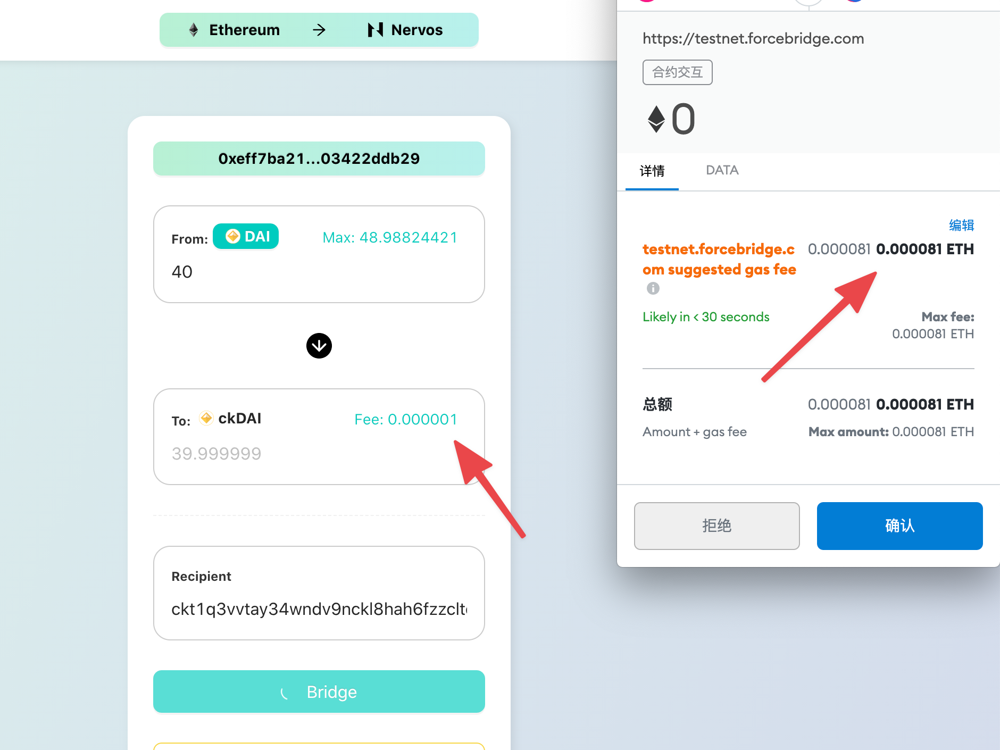

# Force Bridge Dapp User Guide

Force bridge is a cross-chain bridge connecting CKB and other blockchains. Force bridge supports Ethereum currently,
and will support more blockchains, such as Bitcoin, Tron, EOS, etc. Users can use Force Bridge to lock assets on these
blockchains and gain shadow assets on CKB, or to burn mirror assets on CKB and receive original assets.

This article uses Ethereum as an example to introduce the bridge operation between Ethereum and CKB.

## Testnet

Endpoint: <https://testnet.forcebridge.com>

Networks:
- Ethereum: Rinkeby
- CKB: AGGRON4

### Prepare Wallet

If you have a metamask account, you are ready to go. You will use this account to manage assets on Ethereum and CKB (with the help of [pw-lock](https://github.com/lay2dev/pw-lock)).

> You can set up metamask here: https://metamask.io/

### Prepare initial assets

Use this [faucet](https://gliaswap-faucet-rinkeby.ckbapp.dev/) to claim CKB、ETH and ERC-20 assets on Testnet. 

> You need CKB and ETH to pay transaction fee on CKB and Ethereum.

### Start Bridge

#### Etherum to CKB

1. Choose bridge direction: Ethereum to CKB
2. Connect metamask wallet
3. Select the asset you want to bridge and input bridge amount
4. The recipient address is the ckb address([pw-lock](https://github.com/lay2dev/pw-lock)) of your metamask account by default, and will be autofilled for you. If you want another address to receive shadow asset, feel free to replace it.
5. Tap button to bridge

6. Check the bridging status
7. View the details of bridge transactions
8. Succeed bridge history will be here

#### CKB to Ethereum

Change the bridge direction, and the following operations are similar.

## Mainnet

Endpoint: <https://forcebridge.com>

The operation is the same as Testnet.

## Open dapp with parameterized url

- Parameterized url example: https://testnet.forcebridge.com/bridge/:from-network/:to-network?xchain-asset=0x0000000000000000000000000000000000000000&amount=0.05&recipient=ckt1q3vvtay34wndv9nckl8hah6fzzcltcqwcrx79apwp2a5lkd07fdx8xrv9tkdrcff8nwev8q9zzvf40xvdhsmck9seps
  - Explain
    - Url path
      - from-network: string (e.g. Ethereum)
      - to-network: string (e.g. Nervos)
    - Url query
      - xchain-asset: the address of original asset (e.g.,  xchain-asset=0x0000000000000000000000000000000000000000 means ETH asset)
      - amount: the bridge amount (e.g., amount=0.05 means 0.05 ETH)
      - recipient: the address of recipient

## FAQ

### How is the cross chain fee charged?

There are two parts of fee here:
- The transaction fee you pay to the miners. 
  - For Ethereum to Nervos cross chain transaction, it is charged in ETH.
    You can see it in Metamask when you send the transaction ( the right arrow in the below example ).
  - For Nervos to Ethereum cross chain transaction, it is charged in CKB.
    You can check it in Nervos Explorer( The 0.001 CKB in this [example](https://explorer.nervos.org/aggron/transaction/0xd695974e7e7be2029614450c6f25d804b97532f4fc12eed7c477c40e4e055c67) ).
- The bridge operation fee you pay to the operators of Force Bridge. It is charged in the asset you cross chain ( The 
  left arrow in the below example). It's used to cover the costs of operators, including:
  - The infrastructure cost, e.g. servers, bandwidth and so on.
  - The cross chain transaction fee. E.g. CKB transaction fee to mint sudt on Nervos chain when transfer from Ethereum
  to Nervos, Ethereum transaction fee to unlock ETH/ERC20 on Ethereum when transfer from Nervos back to Ethereum.

