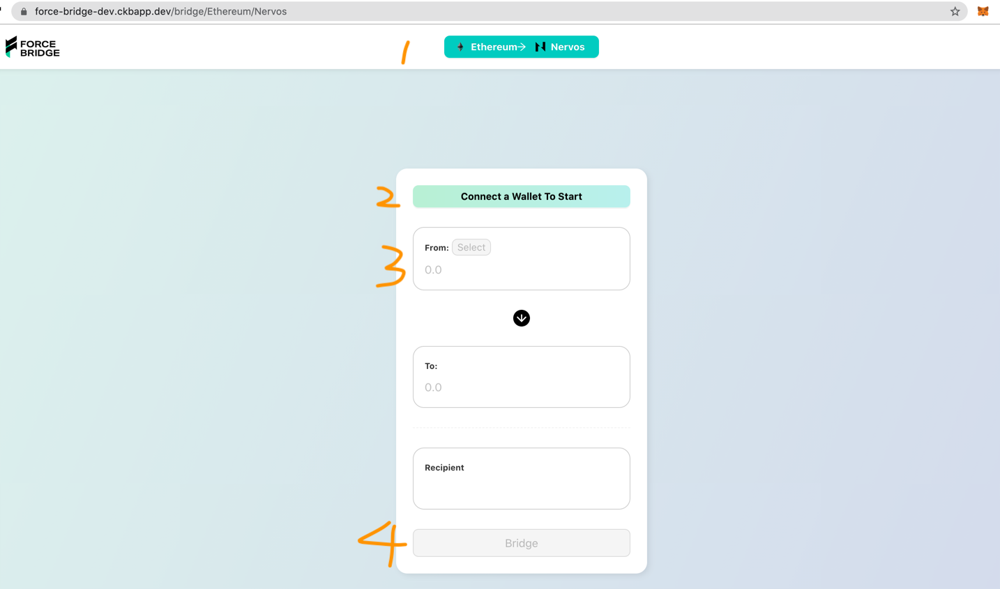
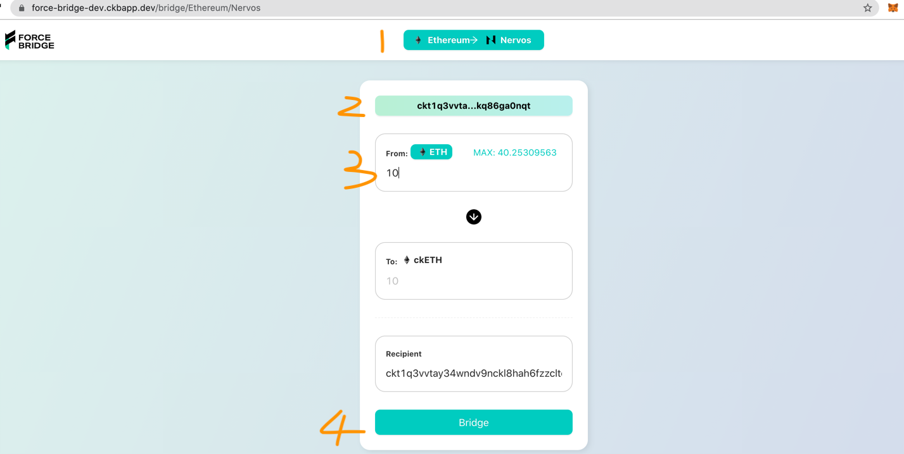
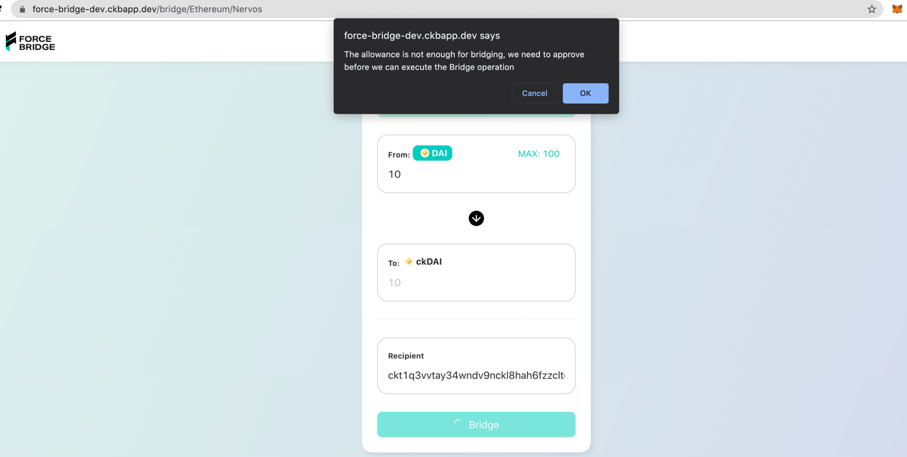
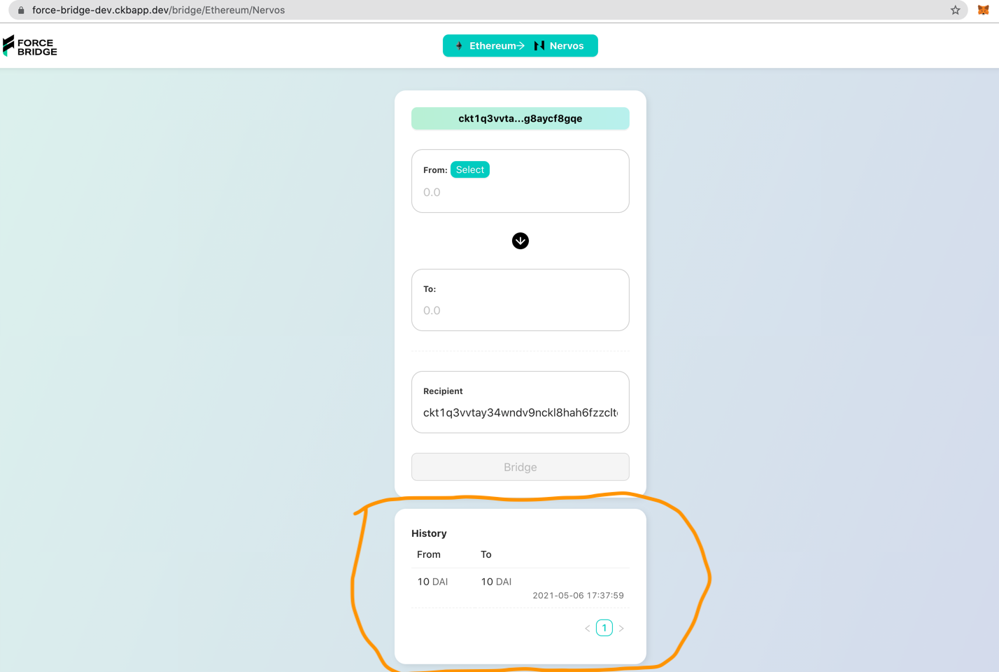
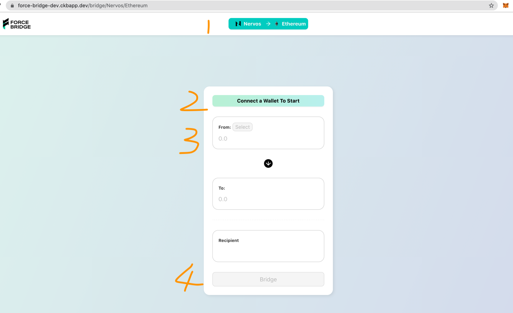
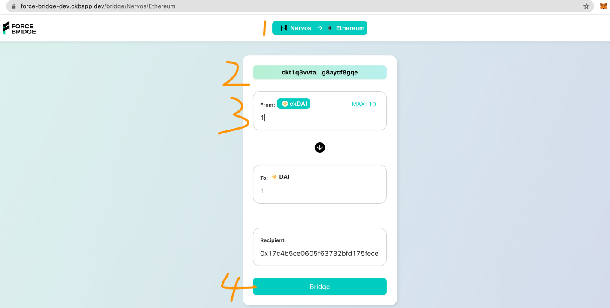
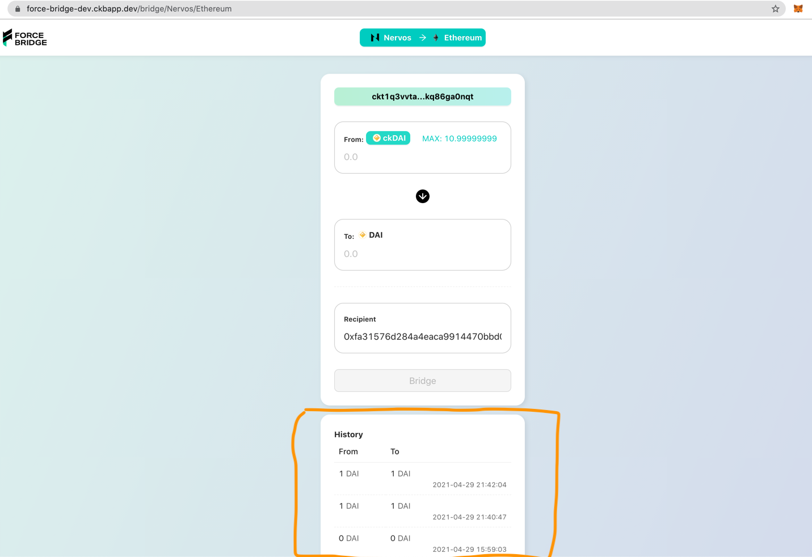

# Force Bridge Dapp 用户使用指南

> UI 正在完善，有些地方后面会改动优化

Force Bridge 是连接 CKB 和其他区块链的跨链桥。目前支持 Bitcoin、Ethereum、Tron  和 Eos 跨链，未来将支持更多区块链项目。用户可以使用 [Force Bridge Dapp](https://force-bridge-dev.ckbapp.dev/bridge/Nervos/Ethereum) 将资产从其他链跨到 CKB 得到对应影子资产，以及将影子资产跨回并得到原生资产。

这片文章以 Ethereum 为例，介绍 Ethereum 测试网 Rinkeby 和 CKB 测试网 Aggron 之间的跨链操作。

## 准备钱包

推荐使用 [Metamask](https://metamask.io/) 钱包，借助 [Pw-Lock](https://github.com/lay2dev/pw-lock) 可以使用 Metamask 在 CKB 上接收和发送资产。

## 水龙头领取资产

- 水龙头地址：https://gliaswap-faucet-rinkeby.ckbapp.dev/

用户需要给自己的地址领取 ETH、CKB，才可以成功进行下面完整的跨链流程；如果需要进行 Erc-20 Token 跨链，我们在测试网上部署好了 DAI、USDT、USDC 三种 Token，用户可以在水龙头领取。

## 跨链操作

### Ethereum to CKB

选择跨链方向为 Ethereum -> Nervos，如下图步骤 1：

#### 连接钱包

点击按钮连接 Metamask 钱包，切换网络为 Rinkeby，选择有资产的地址进行连接，如下图步骤 2：

#### 选择跨链资产和金额

选择跨链资产类型并输入跨链金额，如下图步骤 3：

- 接收地址默认为 Ethereum 地址对应在 CKB 上的 Pw-Lock 地址

#### 发送跨链交易

点击 Bridge 按钮，签名和发送跨链交易，如下图步骤 4：

如果用户选择的跨链资产是 Erc-20 类别，点击 Bridge 按钮，会提示用户先进行 Approve 操作：

等 Approve 交易成功后，用户再进行跨链操作即可。

> Approve 操作的用户交互流程正在完善中

签名发送跨链交易后，用户可在下一小节介绍的历史面板查看跨链状态。

#### 查看跨链状态和历史

用户可以查看正在进行的跨链状态和已完成的跨链历史，跨链历史为钱包所连接地址的跨链记录。

> 该面板功能正在完善中

### CKB to Ethereum

选择跨链方向为 Nervos -> Ethereum，如下图步骤 1：

#### 连接钱包

点击按钮连接 Metamask 钱包，切换网络为 Rinkeby，选择有资产的地址进行连接，如下图步骤 2：

> 提示：记得在水龙头给该钱包地址领取 CKB，否则可能没有余额发送跨链交易

#### 选择跨链资产和金额

选择跨链资产类型并输入跨链金额，如下图步骤 3：

接收地址默认为 Pw-Lock CKB 地址对应在 Ethereum 上的地址

#### 发送跨链交易

点击 Bridge 按钮，签名和发送跨链交易，如下图步骤 4：

签名发送跨链交易后，用户可在下一小节介绍的历史面板查看跨链状态。

#### 查看跨链状态和历史

用户可以查看正在进行的跨链状态和已完成的跨链历史，跨链历史为钱包所连接地址的跨链记录。

> 该面板功能正在完善中

## 使用带参数的 URL 打开 DAPP
### URL 格式
https://force-bridge-dev.ckbapp.dev/bridge/:from-network/:to-network?xchain-asset=0x0000000000000000000000000000000000000000&amount=0.05&recipient=ckt1eeeeeeeeee

- URL Path
  - from-network: string (eg.Ethereum)
  - to_network: string(eg.Nervos)
    
- URL Query
  - xchain-asset: xchain 的资产 id，注意不是影子资产的 id，例如以太坊是 0x0000000000000000000000000000000000000000，也可以是某个 ERC20 合约的地址
  - amount: url 是啥默认就会填啥，需要注意的是，这里是可以带小数信息的，比如想要转 1 ETH，amount 就是 1，而不是 1000000000000000000
  - recipient: 接收人，URL 是啥就会默认填啥
